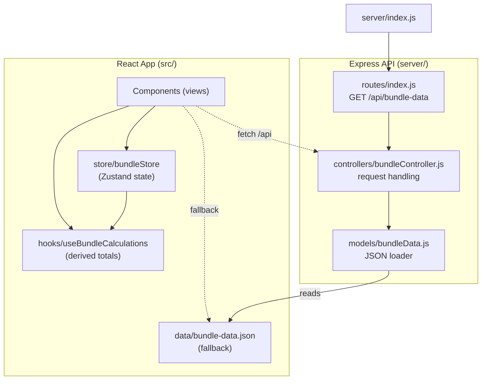

# Wyze Bundle Builder

A production-quality React + TypeScript bundle builder that lets users configure a custom Wyze home security system — choosing cameras, a monitoring plan, sensors, and accessories — with a live review panel that updates in real time.


```

---

## Overview

The application is a two-column (desktop) / stacked (mobile) bundle configuration experience:

- **Left / Top**: A four-step accordion builder (Cameras → Plan → Sensors → Accessories)
- **Right / Bottom**: A live review panel that shows selected items grouped by category, with live quantity steppers, totals, savings, and checkout

The initial state is pre-seeded to match the Figma design on first render.

---

## Setup

The app uses an **MVC server architecture**. The Express API is organized as:

```
server/
├── models/
│   ├── bundleData.js       # JSON loader (base)
│   └── Product.js          # Product queries (getAll, getById, getByCategory)
├── controllers/
│   └── productController.js # Product request handlers (list, getById)
├── routes/
│   ├── routes.js            # Main route definitions
│   └── products.js         # Product-specific routes
└── server.js                # App entry point
```

### API Endpoints

| Endpoint | Description |
|----------|-------------|
| `GET /api/bundle-data` | Full bundle data (products, steps, content) |
| `GET /api/bundle-data/products` | All products (`?category=cameras` to filter) |
| `GET /api/bundle-data/products/:id` | Single product by ID |
| `GET /api/bundle-data/steps` | Steps only |
| `GET /api/bundle-data/content` | Content/text only |

### Setup

```bash
# Install dependencies
npm install

# Terminal 1 — start the API server
npm run server

# Terminal 2 — start the frontend dev server
npm run dev
```

Open [http://localhost:5173](http://localhost:5173).

### Production

```bash
npm run build
npm run preview
```

The Express server serves both the API and the built frontend files.

---

## Build

```bash
npm run build
```

Preview the production build:

```bash
npm run preview
```

---

## Tech Stack

| Technology | Purpose |
|---|---|
| **React 19** | UI component rendering |
| **TypeScript (strict)** | Type safety throughout |
| **Vite** | Build tool and dev server |
| **Zustand** | State management |
| **Zustand Persist** | localStorage persistence |
| **Tailwind CSS v4** | Utility-first styling |
| **clsx** | Conditional class merging |
| **Inter (Google Fonts)** | Typography |

---

## Architecture Decisions

### Zustand Architecture

The store (`src/store/bundleStore.ts`) is the single source of truth for all cart state. Business logic (quantity mutation, variant selection, accordion state) lives in the store, not in components. Components are "dumb" — they read from the store and dispatch actions.

```ts
// Store shape
interface BundleState {
  items: CartItems;                          // [productId][variantId] = qty
  selectedVariants: Record<string, string>; // currently displayed variant
  openStep: number;                          // active accordion step (1–4)
}
```

### Variant Quantity Model

**Each variant maintains its own independent quantity.** This is the core design decision:

```ts
// Example state after selecting White=2, then Black=1 for Wyze Cam v4
items: {
  "wyze-cam-v4": {
    "white": 2,
    "black": 1,
    "grey":  0
  }
}
```

When the user switches the displayed variant selector, only the UI variant view changes — the quantities for all other variants are preserved intact. The review panel renders one line item per `(product, variant)` pair that has `qty > 0`.

Products without variants use a sentinel key `"__default__"` as their variant ID.

### Persistence Strategy

Zustand's `persist` middleware automatically serializes the entire store to `localStorage` under the key `wyze-bundle-builder`. On page load, the persisted state is rehydrated. If the stored JSON is malformed or missing required fields, the `onRehydrateStorage` callback catches the error and falls back to `INITIAL_STATE`.

The "Save my system for later" button calls `saveSystem()` (a no-op in the store, since persist writes automatically) and shows user feedback.

### Component Organization

```
components/
├── AccordionStep/    # Collapsible step with smooth CSS transition
├── ProductCard/      # Card with badge, image fallback, variants, stepper, price
├── VariantSelector/  # Pill buttons with swatch dots
├── QuantityStepper/  # Shared +/- stepper (used in ProductCard + ReviewItem)
├── ReviewPanel/      # Right panel with grouped categories and empty state
├── ReviewItem/       # Single line item row in the review panel
├── SummaryFooter/    # Shipping, guarantee, totals, checkout, save link
└── StepHeader/       # Step number, icon, title, selected count, chevron
```

The `QuantityStepper` component is fully reusable — it takes `productId` and `variantId` as props and connects directly to the store. This means the stepper in the product card and the stepper in the review panel are always synchronized via shared state, with no additional synchronization logic needed.

### Calculations

Review items and totals are derived in `src/hooks/useBundleCalculations.ts` using `useMemo`. The hook reads directly from the store — there is no separate review panel state, eliminating synchronization bugs.

```ts
Current total:  price * quantity
Compare total:  comparePrice * quantity
Savings:        compareTotal - currentTotal
```

---

## Data-Driven Design

Data is loaded from the Express API at `GET /api/bundle-data`. If the API is unavailable, the frontend falls back to the bundled `bundle-data.json` — so the app works standalone without the server running.

1. Add an entry to the `"products"` array with the appropriate `category`
2. Optionally add `variants` for products with color options
3. Seed the initial quantity in `bundleStore.ts` if needed
4. No component code changes required

---

## Responsive Design

| Breakpoint | Layout |
|---|---|
| Mobile (`< lg`) | Single column: Builder → Review Panel (stacked) |
| Desktop (`≥ lg`) | Two column: Builder left, Review Panel right (sticky) |

The product grid uses responsive column counts:
- Mobile: 2 columns
- Tablet: 3 columns
- Desktop (builder only): 2–3 columns depending on screen width

---

## Tradeoffs & Assumptions

1. **Image URLs**: Product images use Wyze's CDN URLs. If CDN URLs are unavailable, the `ProductCard` and `ReviewItem` components fall back to a graceful placeholder icon via the `onError` handler.

2. **Plan in totals**: The `Cam Unlimited` plan is displayed in the review panel with monthly pricing, but excluded from the one-time total calculation. The total reflects only one-time purchase items.

3. **Hub is always FREE**: The `Wyze Sense Hub (Required)` has `price: 0` and `isFree: true` in the data, matching the Figma design.

4. **Financing label**: The "as low as $19.19/mo" financing badge is a static display value, not dynamically calculated (matching Figma design intent).

5. **Checkout**: Triggers a browser `alert()` as specified. No backend integration.

6. **Data source**: The frontend fetches data from the Express API on startup, with a static JSON fallback. If the server is down, the app loads from the bundled JSON directly.

---

## File Structure

```
src/
├── assets/
├── components/
│   ├── AccordionStep/index.tsx
│   ├── ProductCard/index.tsx
│   ├── VariantSelector/index.tsx
│   ├── QuantityStepper/index.tsx
│   ├── ReviewPanel/index.tsx
│   ├── ReviewItem/index.tsx
│   ├── SummaryFooter/index.tsx
│   └── StepHeader/index.tsx
├── data/
│   └── bundle-data.json
├── hooks/
│   └── useBundleCalculations.ts
├── pages/
│   └── BundleBuilderPage.tsx
├── store/
│   └── bundleStore.ts
├── types/
│   └── index.ts
├── utils/
│   └── currency.ts
├── App.tsx
├── main.tsx
└── index.css
```
